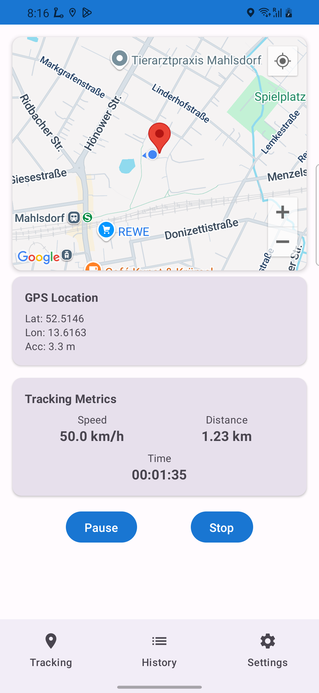

# GPS Tracking & Data Collection App

A modern Android application built with Jetpack Compose and MVVM architecture for real-time GPS tracking and trip recording.

## 📱 App Showcase

<table align="center">
  <tr>
    <td align="center">
      
<strong>Tracking Screen</strong>

      
       
      <em>Real-time GPS tracking with interactive map</em>
    </td>
    <td align="center">
      
<strong>Trip History</strong>

      
       
      <em>Complete trip history with export functionality</em>
    </td>
  </tr>
  <tr>
    <td align="center">
      
<strong>Settings Screen</strong>

      
       
      <em>Customizable tracking settings and preferences</em>
    </td>
    
  </tr>
</table>

## Features

### 🗺️ Tracking Screen
- Real-time GPS location tracking
- Display current location coordinates (latitude, longitude, accuracy)
- Live tracking metrics:
  - Current speed (km/h)
  - Distance traveled (km)
  - Elapsed time (HH:MM:SS)
- Control buttons for:
  - Start tracking
  - Pause/Resume tracking
  - Stop tracking

### 📊 Trip History Screen
- List of all previously recorded trips
- Each trip displays:
  - Start date and time
  - Trip duration
  - Distance traveled
- Delete functionality for individual trips

### ⚙️ Settings Screen
- Configure location update interval:
  - 1 second
  - 5 seconds (default)
  - 10 seconds
  - 30 seconds
- Background tracking toggle
- Current settings summary

## Architecture

### MVVM Pattern
- **ViewModels**: Handle business logic and state management
- **Repository**: Data access layer with Room database
- **DataStore**: User preferences storage
- **LocationService**: GPS location handling

### Data Layer
- **Room Database**: Local storage for trips and location points
- **DataStore**: Settings persistence
- **Location Services**: Real-time GPS updates

### UI Layer
- **Jetpack Compose**: Modern declarative UI
- **Material Design 3**: Consistent design system
- **Navigation Compose**: Screen navigation
- **StateFlow**: Reactive state management

## Technical Stack

- **Language**: Kotlin
- **UI Framework**: Jetpack Compose
- **Architecture**: MVVM
- **Database**: Room
- **Location**: Android Location Services
- **State Management**: Kotlin Coroutines & Flow
- **Navigation**: Navigation Compose
- **Settings**: DataStore Preferences

## Usage

1. **Start Tracking**: Tap "Start Tracking" to begin recording your trip
2. **Pause/Resume**: Use pause and resume buttons during tracking
3. **Stop Tracking**: End the current trip and save it to history
4. **View History**: Navigate to the History tab to see all recorded trips
5. **Configure Settings**: Adjust tracking intervals and background tracking in Settings

## FAKE LOCATION
I used LOKITO APP FOR THE FAKE LOCATION

## Development Setup

1. Clone the repository
2. Open in Android Studio
3. Sync Gradle dependencies
4. Build and run on device/emulator